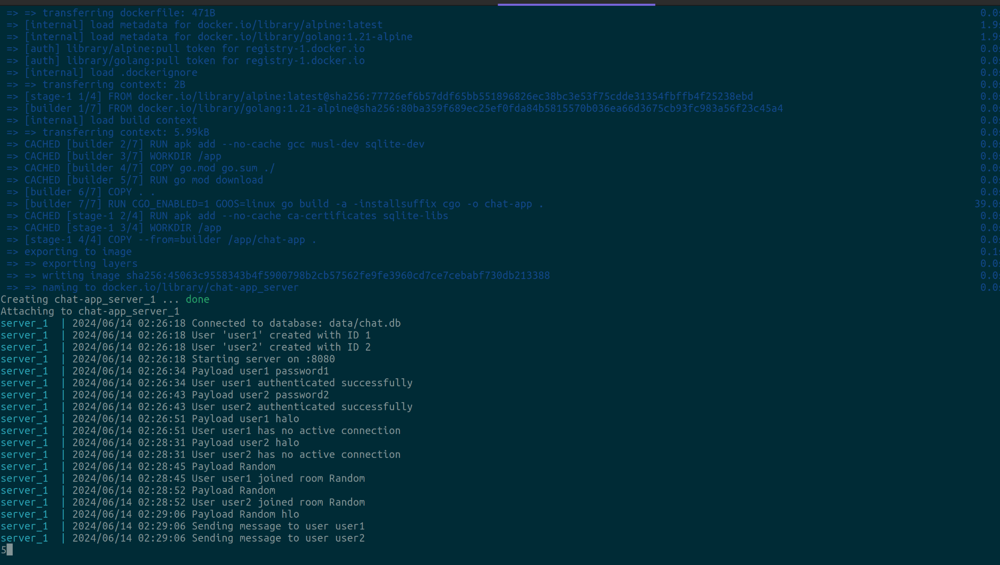

# CLI Chat Application

## Running the Application
Build and start the containers:

```sh
docker-compose up --build
```

Access the client:

Since the client is a CLI application, you can execute it separately :

```sh
go run client/client.go
```

Access the server:

>The server will be running and accessible at http://localhost:8080.

This setup allows you to manage both the server and client applications using Docker and Docker Compose, making it easier to develop, test, and deploy your chat application.



## Implementing Components

`server.go`

This will handle WebSocket connections, user authentication, and message broadcasting.

`client.go`

A command-line interface (CLI) for users to interact with the chat system.

`chatroom.go`

Managing chat rooms, storing messages, handling join/leave actions.

`database.go`

SQLite integration for storing messages.

## Notes
- *Concurrency*: Uses sync.Mutex to handle concurrent access to maps (clients, chatRooms).
- *WebSocket Handling*: Upgrades HTTP connections to WebSocket and manages message broadcasting.
- *Chat Room Management*: Provides functions to create, join, leave, and retrieve chat rooms.
- *Error Handling*: Basic error handling is included. Adjust as per your application's requirements.
- *Logging*: Logs events such as user connections, disconnections, and chat room operations for monitoring and debugging.